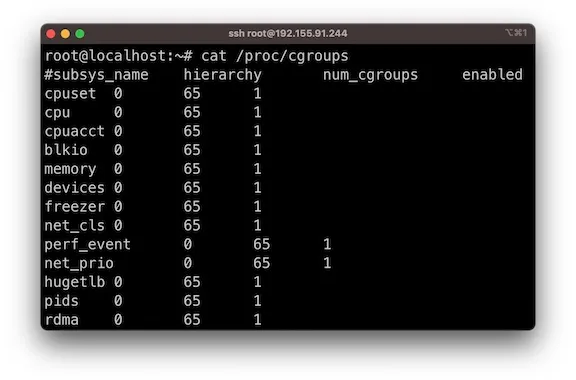
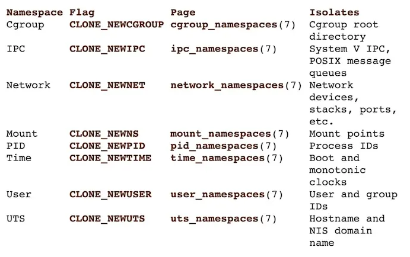

# Container Bausteine 🦸‍♀️

:::info

- nicht Prüfungsrelevant

:::

Container nutzen drei Linux-Funktionen, um ihre Magie zu entfalten:

- cgroups
- namespaces
- Union-Dateisysteme

Cgroups und Namespaces dienen jeweils zur Bereitstellung von
Ressourcenbeschränkungen und Anwendungs-Isolation. Sie verwenden auch ein
Union-Dateisystem, das es ermöglicht, Images auf Basis gemeinsamer Schichten zu
erstellen, was das Erstellen und Teilen von Images schnell und effizient macht.

**Hinweis**: Docker hat Container nicht erfunden. Zum Beispiel wurden
LXC-Container ([https://linuxcontainers.org/](https://linuxcontainers.org/))
bereits 2008 implementiert, fünf Jahre bevor Docker auf den Markt kam. Das heißt
aber nicht, dass Docker keine großen Fortschritte in der Benutzerfreundlichkeit
gemacht hat, was dazu beigetragen hat, dass Container-Technologien eine breite
Akzeptanz gefunden haben und Docker nach wie vor eine der beliebtesten
Plattformen für Containerisierung bleibt.

## Cgroups

Cgroups sind eine Funktion des Linux-Kernels, die es ermöglicht, Prozesse in
hierarchische Gruppen zu organisieren, deren Nutzung verschiedener Arten von
Ressourcen dann begrenzt und überwacht werden kann.

Mit Cgroups kann eine Container-Laufzeitumgebung festlegen, dass ein Container
beispielsweise folgendes nutzen darf:

- Bis zu XX% der CPU-Zyklen verwenden (cpu.shares).
- Bis zu YY MB Arbeitsspeicher verwenden (memory.limit_in_bytes).
- Lesevorgänge auf ZZ MB/s drosseln (blkio.throttle.read_bps_device).

Cgroups auf einem Linux-Computer:

## Namespaces

Ein Namespace umschließt eine globale Systemressource in einer Abstraktion, die
den Prozessen innerhalb des Namespace erscheinen lässt, als hätten sie ihre
eigene isolierte Instanz der globalen Ressource.

Änderungen an der globalen Ressource sind für andere Prozesse, die Mitglieder
des Namespace sind, sichtbar, aber unsichtbar für andere Prozesse.

Mit Namespaces kann eine Container-Laufzeitumgebung Prozesse außerhalb des
Containers innerhalb des Containers unsichtbar machen oder den Benutzer im
Container einem anderen Benutzer auf dem Host zuordnen (unter anderem).

Container sind "chroot" mit einem Marketing Budget.

Verschiedene Namespaces auf Linux:

## Union-Dateisysteme

Ein Union-Dateisystem ermöglicht es, Dateien und Verzeichnisse getrennter
Dateisysteme, bekannt als Zweige, transparent zu überlagern und so ein
einheitliches Dateisystem zu bilden.

Inhalte von Verzeichnissen, die innerhalb der zusammengeführten Zweige denselben
Pfad haben, werden in einem einzigen zusammengeführten Verzeichnis innerhalb des
neuen, virtuellen Dateisystems sichtbar.

Dieser Ansatz ermöglicht eine effiziente Nutzung des Speicherplatzes, da
gemeinsame Schichten geteilt werden können. Wenn beispielsweise mehrere
Container aus demselben Image auf einem einzelnen Host erstellt werden, muss die
Container-Laufzeitumgebung nur einen dünnen Überlagerungsspeicher für jeden
Container zuweisen, während die darunterliegenden Image-Schichten geteilt werden
können.

Overlay-FS-Diagramm: 

Docker bietet ein bequemes Benutzererlebnis, indem die zugrunde liegenden
Technologien (Namespaces, Cgroups und Union-Dateisysteme) in eine einfach zu
bedienende Desktop-Anwendung verpackt werden.

## Zusätzliche Ressourcen

Für eine tiefere Erkundung dieser Themen, schauen Sie sich diesen großartigen
Live-Stream von Joshua Jebaraj an, der cgroups und namespaces erkundet:

  <YouTube id="9ivFrXgB2Zg" />

  <YouTube id="kPJaXbUtR70" />

