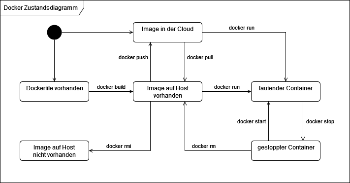

# Grundkonzepte von Docker

## Docker Host

Der Docker Host ist der Computer oder Server, auf dem Docker installiert ist und
läuft. Er ermöglicht es, Container zu erstellen, zu verwalten und auszuführen.
Container sind leichtgewichtige, isolierte Umgebungen, die Anwendungen und deren
Abhängigkeiten enthalten. Der Docker Host sorgt dafür, dass diese Container
effizient und sicher betrieben werden können.

### Docker Image

Ein Docker Image ist eine schreibgeschützte Vorlage, die alle Dateien und
Einstellungen enthält, um eine Anwendung in einem Container auszuführen. Es
besteht aus mehreren Schichten, die aufeinander aufbauen, und kann auf jedem
System mit Docker ausgeführt werden. Images werden meist mit einem Dockerfile
erstellt und können in Registries wie Docker Hub gespeichert und geteilt werden.
Sie sind die Grundlage für Container und ermöglichen eine konsistente
Anwendungsbereitstellung.

### Docker Container

Ein Docker Container ist eine laufende Instanz eines Docker Images, die alles
enthält, um eine Anwendung auszuführen. Er ist isoliert, leichtgewichtig und
teilt sich den Kernel des Host-Betriebssystems, was ihn ressourcenschonend
macht. Container sind portabel und können auf jedem Docker-fähigen System
ausgeführt werden. Sie sind oft temporär und können einfach erstellt, gestoppt
oder gelöscht werden.

### Docker Daemon

Der Docker Daemon ist ein Hintergrundprogramm, das auf dem Docker Host läuft. Er
ist verantwortlich für das Erstellen, Ausführen und Verwalten von Containern.
Der Daemon hört auf Befehle, die von Benutzern oder anderen Programmen gesendet
werden, und führt diese aus, um Container zu starten, zu stoppen oder zu
löschen. Er sorgt dafür, dass alles reibungslos funktioniert und die Container
miteinander kommunizieren können.

#### Interfaces

Der Docker Daemon ist über zwei Interfaces steuerbar:

1. **HTTP-Anfragen**: Der Client schickt Anfragen über das HTTP-Protokoll an den
   Daemon, um Container zu erstellen oder zu verwalten.
2. **Unix-Socket**: Auf Linux- und macOS-Systemen nutzt der Client einen
   speziellen Socket (eine Art Verbindung), um direkt mit dem Daemon zu
   sprechen.

Der Daemon führt die Befehle aus und sendet die Ergebnisse zurück an den Client.
So können Benutzer einfach mit Docker arbeiten.

## Docker Client

Der Docker Client ist ein Programm (`docker`), das es Benutzern ermöglicht, mit
dem Docker Daemon zu kommunizieren. Er wird normalerweise über die Kommandozeile
verwendet, wo man Befehle eingibt, um Container zu erstellen, zu starten oder zu
verwalten. Der Client sendet diese Befehle an den Daemon, der sie dann ausführt.
So können Benutzer einfach und effizient mit Docker arbeiten, ohne sich um die
technischen Details kümmern zu müssen. Der Client kommuniziert mit dem Docker
Daemon auf Windows über HTTP. Auf Unix-Systemen wie macOS/linux wird ein
Unix-Socket, verwendet.

:::tip

- `docker run`: ist also ein Befehl vom Docker Client. Damit dieser
  funktioniert, muss der Docker Daemon gestartet sein.
- Docker Desktop startet den Daemon.
- Auf macOS gibt es auch [Colima](https://github.com/abiosoft/colima), welches
  ebenfalls einen Docker Daemon zur Verfügung stellt. Open-Source, ohne Login
  und Lizenzen.

:::

## Docker Container Registry

Eine Container Registry ist ein Speicherort für Docker Images, wo sie
gespeichert, verwaltet und verteilt werden. Es ermöglicht Benutzern, Images
hochzuladen und herunterzuladen, und kann öffentlich (wie Docker Hub) oder
privat sein. Repositories ermöglichen die Versionierung von Images und dienen
zur Bereitstellung von Anwendungen auf verschiedenen Systemen.

## Abbildungen

### Docker Komponenten

### Statusdiagramm

