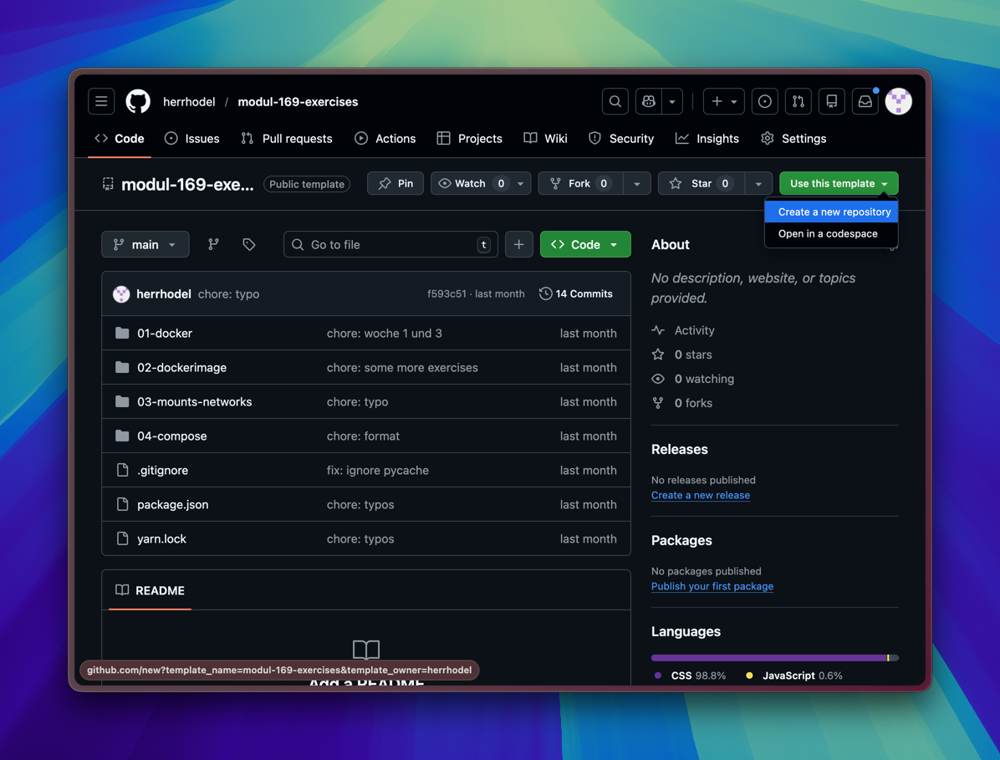
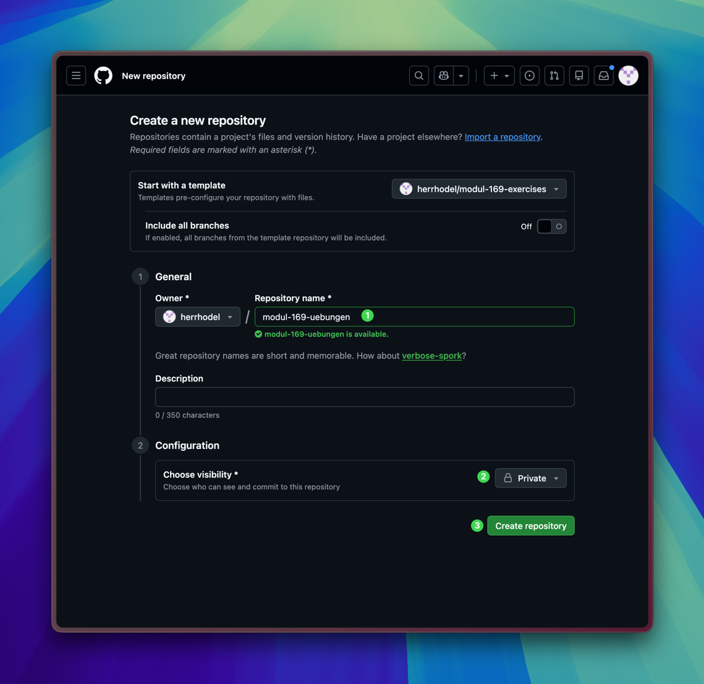
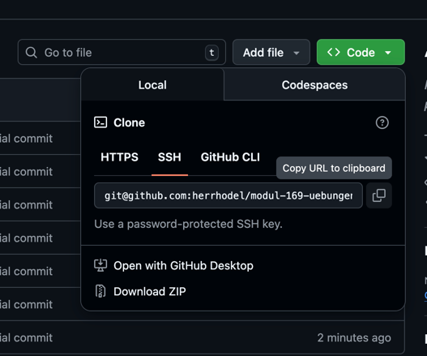

# Git: Übungs-Repository

Es gibt bereits ein Git Repository, welche alle Übungen vom Modul beinhaltet.
Von diesem sollen alle eine Kopie erstellen. Dadurch habt Ihr die Übungen in
einer vorgegebenen Struktur zu Hand.

## 🎯 Ziel

Nach diesem Tutorial kannst du:

- das Übungs-Repository in dein GitHub Account kopieren (create)
- das Übungs-Repository lokal auf deinen Rechner herunterladen (clone)
- die Übungen lokal auf dem Rechner bearbeiten
- Änderungen speichern (add/commit)
- Änderungen wieder nach GitHub hochladen (push)

## :key: 1. SSH Key einrichten

Um ein eigenes Git-Repository von GitHub lokal zu klonen, muss man sich
authentifizieren. Grundsätzlich gibt es zwei Arten, um auf ein Repository
zuzugreifen, _https_ und _ssh_. Da https bei jedem `git pull` und `git push` den
Benutzer und das Passwort abfragt, empfehle ich jedem das Repository via _ssh_
zu klonen. Damit kann man ohne user und passwort arbeiten. Man benötigt jedoch
einen **ssh-key** den man auf GitHub registrieren muss.

Bitte folgt den unten stehenden
[**Anleitungen von GitHub**](https://docs.github.com/en/authentication/connecting-to-github-with-ssh/adding-a-new-ssh-key-to-your-github-account),
um einen
[`ssh-key` zu erstellen](https://docs.github.com/en/authentication/connecting-to-github-with-ssh/generating-a-new-ssh-key-and-adding-it-to-the-ssh-agent)
und auf GitHub zu registrieren.

- [Adding a new SSH key to your GitHub account](https://docs.github.com/en/authentication/connecting-to-github-with-ssh/adding-a-new-ssh-key-to-your-github-account)

:::tip Es gibt einen Windows-Tab auf den Webseiten 😉


:::

## 📷 Template Repository Kopieren

Eine Template Repository ist eine spezielle GitHub Git-Repository, die dazu
gedacht ist, von andern kopiert (und nicht geklont) zu werden. Jede Kopie ist
eigenständig. So könnt Ihr alle eure eigenen Aufgaben lösen, habt, jedoch
denselben Startpunkt.

Bitte folgt diesen Schritten:

1. Zum [Übungs-Repository](https://github.com/herrhodel/modul-169-exercises)
   navigieren.
2. Oben Rechts den Button "Use this template" gefolgt von "Create a new
   repository" wählen. 
3. Namen frei wählen, visibilität auf "Private" setzen und mit "Create
   repository" bestätigen. 

Nun solltet Ihr alle das Repository unter eurem Namen besitzen.

## 📥 Repository lokal klonen

Damit Ihr auf eurem Rechner, lokal, arbeiten könnt, müsst Ihr als Nächstes das
Repository "klonen". Da Ihr bereits einen ssh-key hinterlegt habt, geht dies mit
folgenden Schritten.

1. Auf den Button "\<\>Code" klicken.
2. Unter SSH, die URL mit dem Button rechts kopieren
   
3. Im Terminal, resp. der Git Bash folgenden Befehl eingeben.
   ```bash
   git clone <kopierte-url>
   ```
   Dies erstellt lokal, relativ zur Stelle an der den Befehl ausgeführt wurde,
   einen Ordner unter demselben Namen des Repositories und klont es herunter.
4. In den Ordner wechseln und einen Editor (VS-Code → `code`) starten.

```bash
cd repository-name
code . # . bedeutet den Editor im aktuellen Ordner starten.
```

## 📝 Kleine Änderung nach GitHub pushen

### ✍️  Datei Ändern

1. Öffnet die Datei `01-docker/README.md` in eurem Editor. Z.B.
   `code 01-docker/README.md`.
2. Ändert die Datei nach Belieben.
3. Führt in der Git Bash den Befehl `git status` aus. Es sollte keine Änderung
   sichtbar sein. **Your branch is up to date with 'origin/main'**.

   ```bash
    $ git status
    On branch main
    Your branch is up to date with 'origin/main'.

    Changes not staged for commit:
      (use "git add <file>..." to update what will be committed)
      (use "git restore <file>..." to discard changes in working directory)
      modified:   01-docker/README.md

    no changes added to commit (use "git add" and/or "git commit -a")
   ```

   ✅ **Was passiert:** Git Status gibt an, dass es lokale Änderung gegeben hat,
   diese jedoch noch nicht dauerhaft in Git gespeichert wurden.

:::info

- Eine Datei, die durch den Editor gespeichert wurde, ist nicht automatisch auch
  in Git gespeichert!

:::

4. Führt in der Git Bash den Befehl `git log` aus. Es sollte der erste commit
   sichtbar sein.

   ```bash
   $ git log
   commit 7965e1bf97cd2076aededce256e5220d28e88586 (HEAD -> main, origin/main, origin/HEAD)
   Author: ... <...@bbzbl-it.ch>
   Date:   Sat Jan 24 15:18:08 2026 +0100

       Initial commit
   ```

### 💾 Commiten

5. Mit folgendem Befehl wird die Änderung bestätigt und mit einer Nachricht
   committet.

```bash
git commit -am "Eine erste kleine Änderung"
```

✅ **Ergebnis:** Du hast den ersten Zustand deines Projekts dauerhaft
gespeichert. Git hat jetzt **eine Version** mit einer Nachricht:

6. Führt in der Git Bash den Befehl `git log` nochmals aus. Es existiert ein
   neuer commit.

   ```bash
   $ git log
   commit d703895182507d8a1cffe480f00819b5140080ba (HEAD -> main)
   Author: ... <...@bbzbl-it.ch>
   Date:   Sat Jan 24 15:44:59 2026 +0100

       Eine erste kleine Änderung

   commit 7965e1bf97cd2076aededce256e5220d28e88586 (origin/main, origin/HEAD)
   Author: ... <...@bbzbl-it.ch> Date: Sat Jan 24 15:18:08 2026 +0100

       Initial commit
   ```

7. Führt in der Git Bash den Befehl `git status` aus.

   ```bash
   $ git status
   On branch main
   Your branch is ahead of 'origin/main' by 1 commit.
   (use "git push" to publish your local commits)

   nothing to commit, working tree clean
   ```

### 🔁 Nach GitHub pushen

8. Wie `git status` erwähnt, kann nun der lokale Stand mit `git push` nach
   GitHub hochgeladen (gepushed) werden.

   ```bash
   git push
   ```

   ganzer Log

   ```bash
    $ git push
    Enumerating objects: 7, done.
    Counting objects: 100% (7/7), done.
    Delta compression using up to 10 threads
    Compressing objects: 100% (3/3), done.
    Writing objects: 100% (4/4), 368 bytes | 368.00 KiB/s, done.
    Total 4 (delta 2), reused 0 (delta 0), pack-reused 0 (from 0)
    remote: Resolving deltas: 100% (2/2), completed with 2 local objects.
    To github.com:herrhodel/modul-169-uebungen.git
      7965e1b..d703895  main -> main
   ```

✅ **Was passiert:**  
Git push komprimiert den ganzen Ordner (ähnlich wie ZIP) und ladet ihn hoch.
Dabei werden nur die Änderungen hochgeladen, die neu hinzugefügt wurden. Daher
ist git sehr effizient und schnell!
