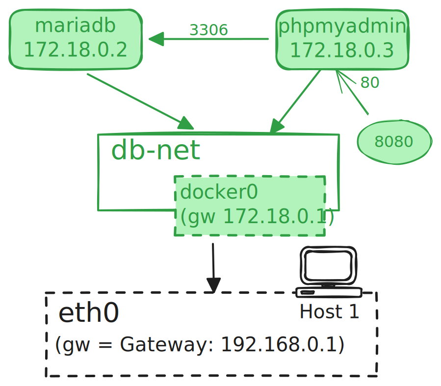

# Übung 4

## Diagramme

### Ziel

Sie sollen lernen ein Docker-Netzwerk in logischer Form aufzuzeichnen.

### Auftrag

Erstellen Sie von der [Übung 3](./aufgabe-networks-03.md): "MariaDB und
phpMyAdmin im Docker-Netzwerk" ein **Logisches** Netzwerkdiagramm.

- Verwenden sie als Referenz die Seite
  ["Docker Netzwerk - Diagramme"](/docs/woche05/network-diagramme.md#logische-netzwerk-diagramme)
- Als [Tool soll Excalidraw](/docs/woche05/network-diagramme#tools) verwendet
  werden

Lösung:

