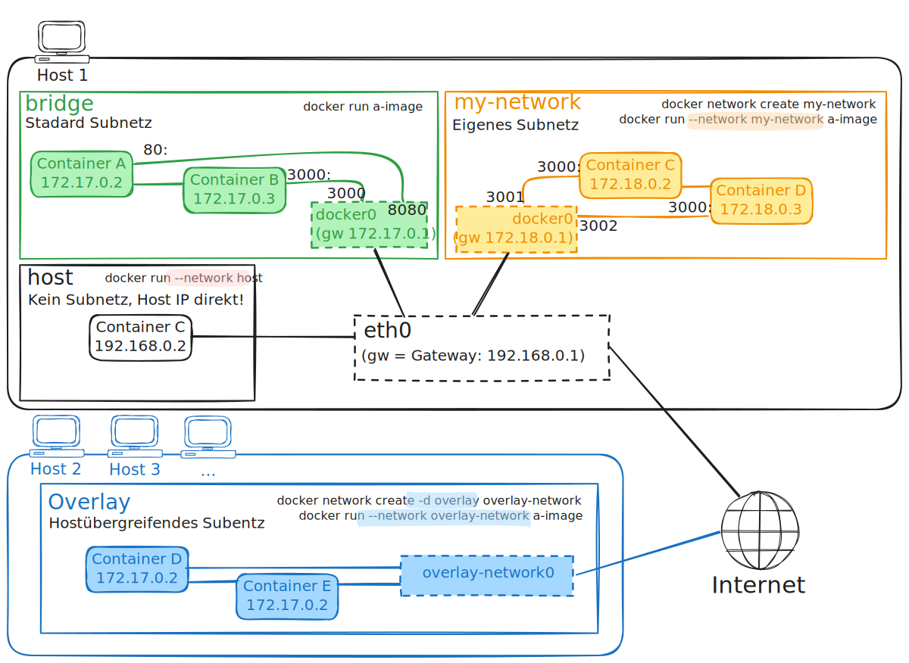
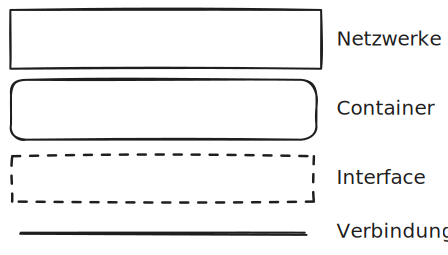
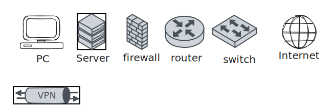

<!-- _class: big center -->

# Docker Networks

## Modul 169

---

# Inhalt

:::columns

- **Repetition**
- **Prüfung**

::: split

- **Docker Netzwerke**
- **Übungen**<br/> _zu Docker Netzwerke_

:::

---

<!-- _class: big center -->

# Regeln 👮‍♀️

## _INP24C_ spezial

---

# §1 Fokus und Geräte

::: columns

Die **digitalen Geräte**: 📱, 💻, etc.

- immer nur auf **Aufforderung der Lehrkraft**
- immer nur zur **Bearbeitung der gestellten Aufgaben**

**Private Aktivitäten sind untersagt**: _unter anderem Social Media, Spiele,
Videos, private E-Mails/Chats, Surfen, Shoppen, etc._

::: split s1

### 1. Verwarnung

- **Mündliche** Ermahnung durch Lehrperson

### 2. Verwarnung

- 👨‍🏫 Das Gerät ist für den **Rest der Lektion bei der Lehrperson** zu
  hinterlegen.
- 🚨 **Absenz**, wenn dadurch nicht gearbeitet werden kann!
- 🗣️ **Meldung an den Berufsbildner**.

:::

---

# §2 Ruhe und Umgangsformen

::: columns

Die Konzentration der Mitschüler muss gewährleistet sein.

- **Lärm ist zu vermeiden**<br/> z.B. laute Gespräche, Geräusche, Rufen.

- **Freundlicher, höflicher und respektvoller** Umgangston

::: split s1

### 1. Verwarnung

- **Mündliche** Ermahnung durch Lehrperson.
- Evtl. auf separaten Arbeitsplatz versetzen.

### 2. Verwarnung

- 🚪 Für den Rest der Lektion **aus dem Unterricht gewiesen**.
- 🚨 Die gesamte Lektion gilt als **Absenz**.
- 🗣️ **Meldung an den Berufsbildner**.

:::

---

# Prüfung

---

<!-- _class: big -->

## Repetition

# Was passiert mit neu erstellten Daten, wenn ein Container gestoppt und gelöscht wird?

---

<!-- _class: big -->

## Repetition

# Was ist ein Bind Mount?

---

<!-- _class: big -->

## Repetition

# Was ist ein Docker Volumen?

---

<!-- _class: big -->

# Wie können Container miteinander kommunizieren?

- Warum sollten sie das können?

- Gibt es Sicherheitsaspekte?

---

<!-- _class: big center -->

# Docker Networks

---



---

# Demo docker network

```bash
docker network ls
docker network inspect bridge
docker network create my-network
docker network ls

docker run -d --rm --name my-container --network my-network nginx
docker inspect my-container

docker network disconnect my-network my-container
docker inspect my-container

docker network connect my-network my-container
docker inspect my-container

docker container stop my-container
docker network rm my-network
```

---

# Netzwerk Diagramme

1. Es gibt keinen wirklichen Standard.

2. Es gibt Icons von Cisco, AWS, ...
3. **Physikalische** Diagramme: beschreiben **Hardware**.
4. **Logische** Diagramme: beschreiben **Zusammenhänge**.

---

# Physikalische Netzwerk Diagramme


---

# Logische Netzwerk Diagramme


---

# Legende

::: columns

## Logisch

Nicht genau definiert, sollte aber konsistent sein.



::: split

## Physikalisch

Cisco gilt quasi als Standard



:::
