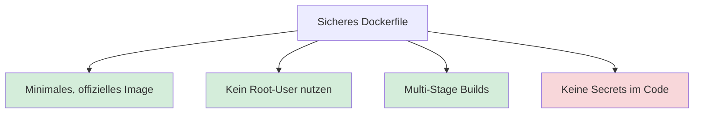

<!-- _class: big center -->

# Docker Security

## Modul 169

---

# Inhalt

:::columns

- **Docker Security**
- **Übungen**<br/> _zu Docker Security_

::: split

- **Repetition**
- **An Aufgaben der letzten Wochen arbeiten**
- **Übungstest auf Classtime**

:::

---

<!-- _class: big center -->

# Regeln 👮‍♀️

---

# §1 Fokus und Geräte

Die **digitalen Geräte**: 📱, 💻, etc.

- immer nur auf **Aufforderung der Lehrkraft**

- immer nur zur **Bearbeitung der gestellten Aufgaben**

**Private Aktivitäten sind untersagt**: _unter anderem Social Media, Spiele,
Videos, private E-Mails/Chats, Surfen, Shoppen, etc._

---

# §2 Ruhe und Umgangsformen

Die Konzentration der Mitschüler muss gewährleistet sein.

- **Lärm ist zu vermeiden**<br/> z.B. laute Gespräche, Geräusche, Rufen.

- **Freundlicher, höflicher und respektvoller** Umgangston

---

# Wofür werden Docker Volumen verwendet?

---

# Worin unterscheiden sich Volumen zu Bind Mounts?

---

# :pencil: Auftrag

::: columns l60

Machen Sie beliebige Übungen den vorherigen Wochen.

- [Übungen Mounts](/docs/woche03/uebungen-mounts/aufgabe-mounts-01)
- [Übungen Volumes](/docs/woche03/uebungen-volumes/aufgabe-volume-05)

::: split

- :dna: Einzelarbeit
- :clock1: bis zur grossen Pause

:::

---

# Sicherheitsprinzipen im Dockerfile



---

# Minimales, offizielles Image

::: columns r60

## Minimal

```dockerfile
FROM node:20-alpine
WORKDIR /app
COPY package*.json ./
RUN npm install --production
COPY . .
CMD ["node", "index.js"]
```

💡 Weniger Programme, weniger Angriffsfläche.

::: split

## Ubuntu mit node installiert

```dockerfile
FROM ubuntu:22.04
RUN apt-get update && apt-get install -y \
    curl \
    gnupg \
    && curl -fsSL https://deb.nodesource.com | bash - \
    && apt-get install -y nodejs && apt-get clean \
    && rm -rf /var/lib/apt/lists/*
WORKDIR /app
COPY package*.json ./
RUN npm install
COPY . .
CMD ["node", "index.js"]
```

:::

<!-- 
--- List all Packages etc.
- for ubuntu: dpkg -l | wc -l
- for node:20-alpine: apk info | wc -l
 -->

---

# Kein Root-User nutzen

```dockerfile
FROM ubuntu:22.04
RUN apt-get update && apt-get install -y curl \
    && curl -fsSL https://deb.nodesource.com | bash - \
    && apt-get install -y nodejs && rm -rf /var/lib/apt/lists/*
# Eigenen Benutzer und Gruppe anlegen und verwenden
RUN adduser --system --group --home /home/appuser appuser
WORKDIR /app
RUN chown appuser:appuser /app # Rechte setzen
USER appuser # User appuser verwenden
COPY --chown=appuser:appuser package*.json ./ # Berechtigungen geben
RUN npm install --production
COPY --chown=appuser:appuser . .
CMD ["node", "index.js"] # App starten
```

- :bulb: Weniger Rechte ist immer sicherer!

<!-- `--system` Creates a system user (UID < 1000, no login shell, no password, used to run services) -->


---

# Minimale Images haben oft einen User parat

```dockerfile
FROM node:20-alpine

# Verzeichnis erstellen und Berechtigungen setzen
RUN mkdir -p /home/node/app && chown -R node:node /home/node/app
WORKDIR /home/node/app

# Zum Nicht-Root-Benutzer wechseln
USER node

# Dateien kopieren und dabei direkt den Besitzer ändern (--chown)
COPY --chown=node:node package*.json ./
RUN npm install

COPY --chown=node:node . .

CMD ["node", "index.js"]
```

<!--
--- Demo User
`docker run -it --rm node:20-alpine sh`
`cat /etc/passwd`
 -->

---

# Multistage verkleinert produktives Image

```dockerfile
FROM node:20 AS builder
WORKDIR /app
COPY package*.json ./
COPY server.js ./
RUN npm install

# Stage 2: Production stage "slim!"
FROM node:20-slim
WORKDIR /app
COPY --from=builder /app .
EXPOSE 3000
CMD ["npm", "start"]
```

- :bulb: Weniger Programme, weniger Angriffsfläche.

---

# Keine Secrets im Code

::: columns l60

### ✅ Richtig

```bash
# Datei mit Secret erstellen, Achtung: Bash-History leeren!
echo "MY_PASSWORD=super-geheim-123" > .env.secret

# Container starten und die Datei einbinden
docker run -d \
  --name meine-app \
  --env-file .env.secret \
  mein-node-image
```

- Secrets werden als ENV-Vars in den **Container beim Starten** geladen.
- `*.secret` ins `.gitignore`.

::: split

### 🚨 Falsch

```dockerfile
FROM node:20-alpine
# 🚨 PIIIP Falsch!
ENV MY_PASSWORD="super-geheim-123"
```

- **NIE** als ENV im Dockerfile
- **NIE** in git eingecheckt!

:::

---

# 👮‍♀️ Supersicher → fnox

```bash
fnox init
# Ein Secret verschlüsselt hinzufügen (wird in fnox.toml gespeichert)
fnox set DB_PASSWORD "mein-super-geheimes-passwort"

# fnox entschlüsselt DB_PASSWORD und übergibt es an Docker
fnox exec -- docker run -d \
  --name meine-app \
  -e DB_PASSWORD \
  mein-node-image
```

- Dadurch ist das Passwort auch auf der Maschine nicht in Klartext vorhanden und
  könnte sogar in git eingecheckt werden.
- Mehr auf [fnox](https://fnox.jdx.dev/)

---

# Secrets mit docker-compose.yml

```bash
# Datei mit Secret erstellen, Achtung: Bash-History leeren!
echo "MY_PASSWORD=super-geheim-123" > password.txt
```

```yaml
services:
  app:
    image: mein-node-image
    secrets:
      - db_password

secrets:
  db_password:
    file: ./password.txt
```

<!-- 
--- Secrets vs. Env Vars ---
- secrets are mounted to `/run/secrets/<secret-name>
- secrets as `env variables` are visible in `docker inspect`, secrets files are not -> more secure! 
-->
<!-- 
--- Bash History ---
history -> list entries with line numbers 
history -d 99 -> delete entry number 99, effective after logout of current shell -->


---

# 📖 Auftrag

::: columns l60

Lesen Sie "Docker Security" von der Woche 4

- [Docker Security](/docs/woche08/docker-security)

::: split

- :dna: Einzelarbeit
- :clock1: 15 min

:::

---

# 📝 Auftrag

::: columns l60

Gehen Sie durch alle [`Dockerfile` Aufgaben](https://michisalm.github.io/modul-169-website/docs/woche02/uebungen/aufgabe-einfaches-dockerfile) von Woche 2 durch und versuchen Sie mit KI Ihrer
Wahl die Aufgaben sicherer zu machen.

::: split

- :dna: Einzelarbeit
- :clock1: 15 min

:::


---

# 📝 Auftrag

::: columns l60

Lösen Sie die [Übungen der Woche 4](https://michisalm.github.io/modul-169-website/docs/woche04/uebungen/aufgabe-security-01) .

::: split

- :dna: Einzelarbeit
- :clock1: 45 min

:::