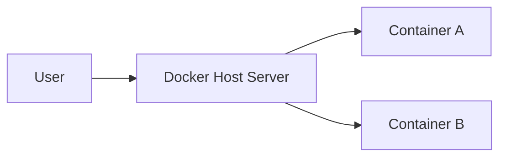
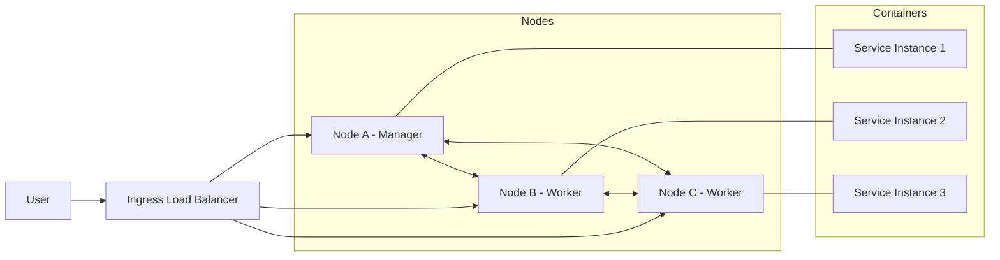
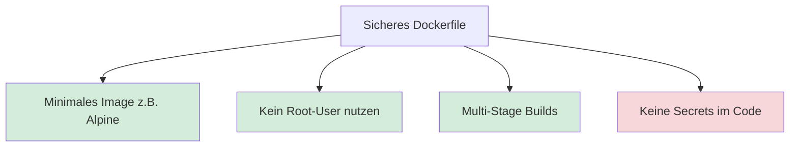

<!-- _class: big center -->

# Docker Compose → Docker Swarm Mode <br/> / Security

## Modul 169

---

# Inhalt

:::columns

- **Repetition**
- **Docker Compose → Docker Swarm Mode**

::: split

- **Security**
- **Übungen**<br/> _zu Docker Compose_ (Woche 06)

:::

---

<!-- _class: big center -->

# Regeln 👮‍♀️

## _INP24C_ spezial

---

# §1 Fokus und Geräte

::: columns

Die **digitalen Geräte**: 📱, 💻, etc.

- immer nur auf **Aufforderung der Lehrkraft**
- immer nur zur **Bearbeitung der gestellten Aufgaben**

**Private Aktivitäten sind untersagt**: _unter anderem Social Media, Spiele,
Videos, private E-Mails/Chats, Surfen, Shoppen, etc._

::: split s1

### 1. Verwarnung

- **Mündliche** Ermahnung durch Lehrperson

### 2. Verwarnung

- 👨‍🏫 Das Gerät ist für den **Rest der Lektion bei der Lehrperson** zu
  hinterlegen.
- 🚨 **Absenz**, wenn dadurch nicht gearbeitet werden kann!
- 🗣️ **Meldung an den Berufsbildner**.

:::

---

# §2 Ruhe und Umgangsformen

::: columns

Die Konzentration der Mitschüler muss gewährleistet sein.

- **Lärm ist zu vermeiden**<br/> z.B. laute Gespräche, Geräusche, Rufen.

- **Freundlicher, höflicher und respektvoller** Umgangston

::: split s1

### 1. Verwarnung

- **Mündliche** Ermahnung durch Lehrperson.
- Evtl. auf separaten Arbeitsplatz versetzen.

### 2. Verwarnung

- 🚪 Für den Rest der Lektion **aus dem Unterricht gewiesen**.
- 🚨 Die gesamte Lektion gilt als **Absenz**.
- 🗣️ **Meldung an den Berufsbildner**.

:::

---

# Was ist Docker Compose?

✅ Definiert **Multi-Container-Anwendungen** in einer YAML-Datei.

- **Fokus:** Lokale Entwicklung & Einzel-Host.
- **CLI:** `docker compose <command>` + `docker-compose.yml`.
- **Limit:** Wenn der Server ausfällt, ist die Anwendung offline.

---

# Docker Compose (Single Host)



---

# Was ist Docker Swarm Mode?

✅ Definiert **Multi-Container-Anwendungen** in einer YAML-Datei.

✅ **Verbindet mehrere Docker-Hosts zu einem virtuellen Cluster**.

- **Fokus:** Hochverfügbarkeit & Produktion.
- **CLI:** `docker swarm init` + `docker swarm join`
  - `docker stack deploy` + `docker-stack.yml`.
- **Limit:** Unterstütz **kein build**, nur fertige Images

---

# Docker Swarm Mode (Multi Host)



---

# Die Hautpunterschiede

| Feature         | Docker Compose      | Docker Swarm (Stack)        |
| :-------------- | :------------------ | :-------------------------- |
| **Datei**       | docker-compose.yml  | docker-stack.yml            |
| **Befehl**      | `docker compose up` | `docker stack deploy`       |
| **Replikation** | Manuell             | Deklarativ via `replicas`   |
| **Skalierung**  | Einzelner Host      | Über den gesamten Cluster   |
| **Builds**      | Erlaubt `build: .`  | **Benötigt fertige Images** |

---

# YAML Erweitern für Swarm

```yaml
services:
  web:
    image: my-app:latest
    deploy: # <--- Spezifisch für Swarm
      replicas: 3
      restart_policy:
        condition: on-failure
      update_config:
        parallelism: 1
        delay: 10s
```

---

# 📝 Auftrag

::: columns l60

Zusammen erarbeiten wir die Aufgabe "Docker Voting App"

- [Docker Voting App](https://herrhodel.github.io/modul-169-website/docs/woche08/docker-voting-app)

::: split

- :dna: Zusammen
- :clock1: 20 min

:::

---

# 📝 Auftrag

::: columns l60

Zusammen erarbeiten wir die Aufgabe "Docker Voting App"

- [Docker Voting App](https://herrhodel.github.io/modul-169-website/docs/woche08/docker-voting-app)

::: split

- :dna: Zusammen
- :clock1: 20 min

:::

---

<!-- _class: big center -->

# Security

---

# Dockerfile



---

# Network
