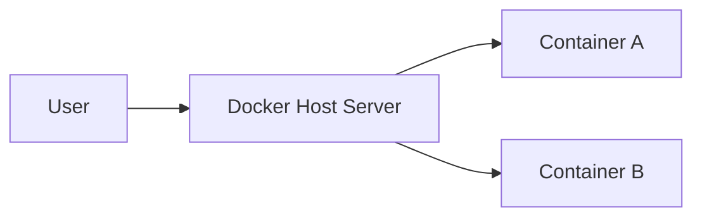
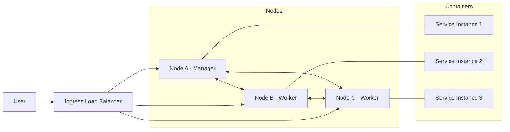
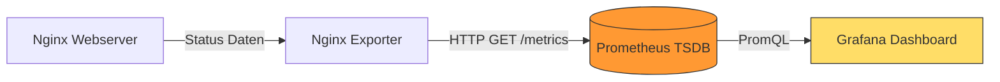

<!-- _class: big center -->

# Docker Swarm Mode

## Modul 169

---

# Inhalt

:::columns

- **Repetition**
- **Von Compose zu Swarm Mode**
- **Testlauf LB2** (Kurzversion)
- **Fragen LB2 & individuelle Repetion**

:::

---

<!-- _class: big center -->

# Regeln 👮‍♀️

---

# §1 Fokus und Geräte

Die **digitalen Geräte**: 📱, 💻, etc.

- immer nur auf **Aufforderung der Lehrkraft**
- immer nur zur **Bearbeitung der gestellten Aufgaben**

**Private Aktivitäten sind untersagt**: _unter anderem Social Media, Spiele,
Videos, private E-Mails/Chats, Surfen, Shoppen, etc._

---

# §2 Ruhe und Umgangsformen

Die Konzentration der Mitschüler muss gewährleistet sein.

- **Lärm ist zu vermeiden**<br/> z.B. laute Gespräche, Geräusche, Rufen.

- **Freundlicher, höflicher und respektvoller** Umgangston

---

<!-- _class: big -->

## Repetition

# Was ist Docker Compose?

---

# Was ist Docker Compose?

✅ Definiert **Multi-Container-Anwendungen** in einer YAML-Datei.

- **Fokus:** Lokale Entwicklung & Einzel-Host.
- **CLI:** `docker compose <command>` + `docker-compose.yml`.
- **Limit:** Wenn der Server ausfällt, ist die Anwendung offline.

---

# Docker Compose (Single Host)



---

# Was ist Docker Swarm Mode?

✅ Definiert **Multi-Container-Anwendungen** in einer YAML-Datei.

✅ **Verbindet mehrere Docker-Hosts zu einem virtuellen Cluster**.

- **Fokus:** Hochverfügbarkeit & Produktion.
- **CLI:** `docker swarm init` + `docker swarm join`
  - `docker stack deploy` + `docker-stack.yml`.
- **Limit:** Unterstütz **kein build**, nur fertige Images

---

# Docker Swarm Mode (Multi Host)



---

<!-- _class: auto-table-3 -->

# Die Hautpunterschiede

| Feature         | Docker Compose      | Docker Swarm (Stack)        |
| :-------------- | :------------------ | :-------------------------- |
| **Datei**       | docker-compose.yml  | docker-stack.yml            |
| **Befehl**      | `docker compose up` | `docker stack deploy`       |
| **Replikation** | Manuell             | Deklarativ via `replicas`   |
| **Skalierung**  | Einzelner Host      | Über den gesamten Cluster   |
| **Builds**      | Erlaubt `build: .`  | **Benötigt fertige Images** |

---

# YAML Erweitern für Swarm

```yaml
services:
  web:
    image: my-app:latest
    deploy: # <--- Spezifisch für Swarm
      replicas: 3
      restart_policy:
        condition: on-failure
      update_config:
        parallelism: 1
        delay: 10s
```

---

# 📝 Auftrag

::: columns l60

Zusammen erarbeiten wir die Aufgabe "Docker Voting App"

- [Docker Voting App](/docs/woche08/docker-voting-app)

::: split

- :dna: Zusammen
- :clock1: 20 min

:::

---

# Testlauf LB2

---

# Monitoring mit Graphana

- **Prometheus**: Pollt Metriken aktiv via HTTP.
- **Grafana**: Visualisiert Daten in Dashboards.
- **Nginx**: Dient als konkretes Monitoring-Beispiel.

---

# Datenfluss mit Nginx Exporter



- **Poll-Prinzip**: Prometheus ruft Daten aktiv ab (Scraping).
- **Nginx Exporter**: Übersetzt Nginx-Status in Prometheus-Format.
- **Intervall**: Der Poll erfolgt zyklisch (z.B. alle 15 Sekunden).

---

# Kernkomponenten im Detail

::: columns

### 1. Nginx & Exporter

- Nginx stellt `/nginx_status` bereit.
- Exporter wandelt dies in Metriken um.

### 2. Prometheus (Pull-Basis)

- Holt Metriken aktiv vom Exporter ab.
- Speichert Daten in der TSDB.

::: split

### 3. Grafana (Visualisierung)

- Fragt Prometheus via PromQL ab.
- Zeigt Requests und Fehlerraten live an.

:::
