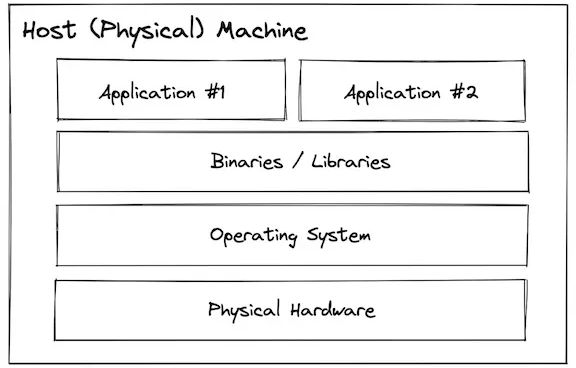
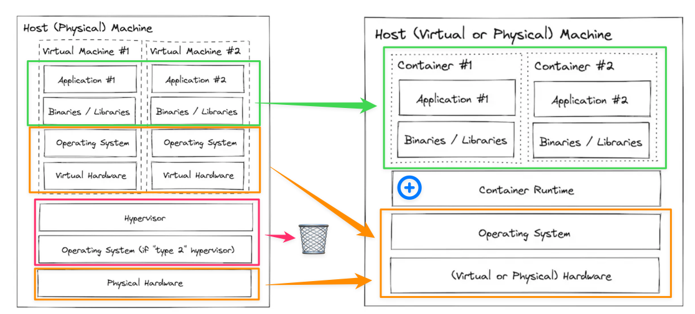
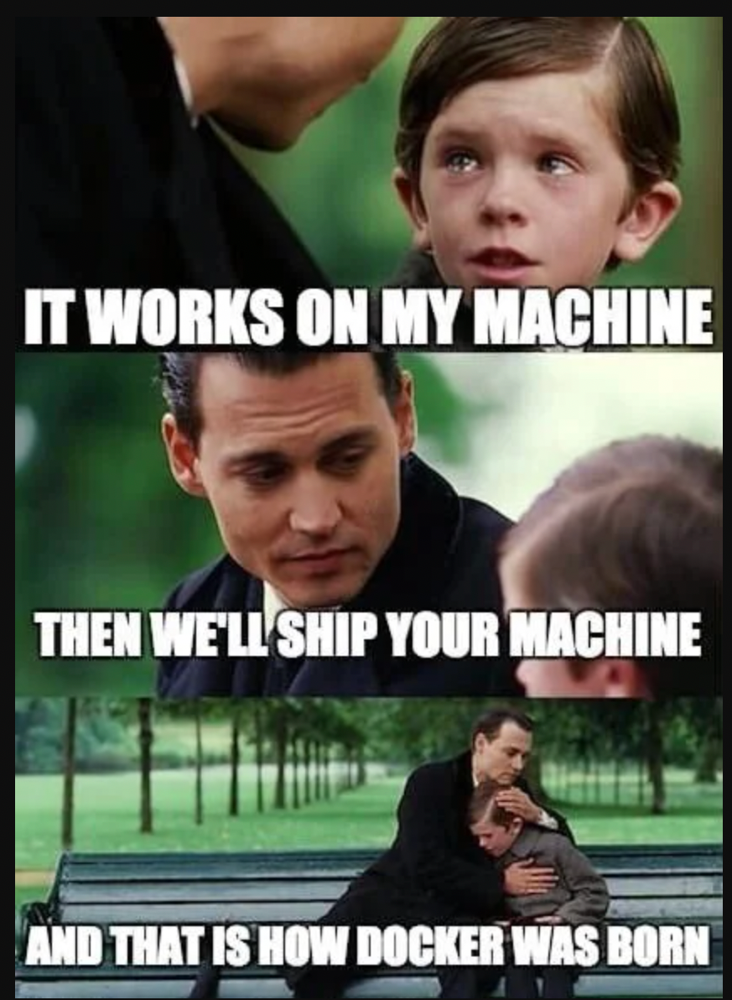
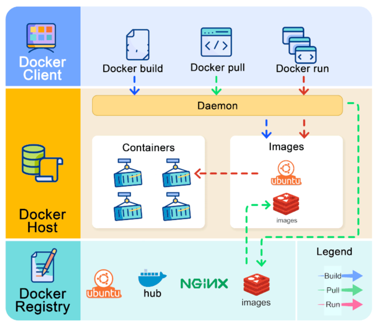

<!-- _class: big center -->

# Modul 169

## Services mit Containern bereitstellen

---

# Handlungsziele _1/2_

1. Definiert die erforderliche Umgebung für die automatisierte Bereitstellung
   von Services.
2. Dokumentiert den logischen und physischen Aufbau der Umgebung in einem
   Netzwerkschema mit servicespezifischen Angaben
3. Erstellt und dokumentiert den für die Service-Breitstellung erforderlichen
   Code versioniert.
4. Plant und realisiert die servicespezifischen Sicherheitsanforderungen.

---

# Handlungsziele _2/2_

5. Erstellt die erforderlichen Datenverbindungen zwischen unterschiedlichen
   Services.
6. Stellt die Services in der definierten Umgebung reproduzierbar bereit.
7. Administriert und überwacht die bereitgestellten Services.
8. Versteht anhand der Dokumentation die Funktionalität der Services und
   unterstützt bei der Fehlersuche.

---

# Unterrichtsaufbau

- Anfangs und nach der grossen Pause Theorie, dann praktische Übungen

---

# Modulwebseite

- [Webseite](https://herrhodel.github.io/modul-169-website/docs)

- [Übungs Repository](https://github.com/herrhodel/modul-169-exercises)

---

# 🚧   Modul ist aktiv in Bearbeitung!

- Ich werde jede Woche das Modul erweitern, die Webseite ist noch nicht 100%
  final!

---

# LBs

::: columns

## LB1

Theoretische Grundlagen von Container

- **Wann**: Woche 4

- **Gewichtung**: 50%

- **Wie**: Schriftlich mit Classtime.net

::: split

## LB2

Alle Themen vom Modul

- **Wann**: Woche 9
- **Gewichtung**: 50%
- **Wie**: Praktisch in einer Ubuntu VM + Classtime

:::

---

# Was ist mir wichtig

- **Aktive** Teilnahme

- Stellen Sie **Fragen**
- **Experimentieren** Sie
- Rückmeldung an mich, wenn etwas nicht in Ordnung ist
- **Nutzen Sie die Zeit** während dem Unterricht

---

<!-- _class: big center -->

# Regeln 👮‍♀️

## _INP24C_ spezial

---

# §1 Fokus und Geräte

::: columns

Die **digitalen Geräte**: 📱, 💻, etc.

- immer nur auf **Aufforderung der Lehrkraft**
- immer nur zur **Bearbeitung der gestellten Aufgaben**

**Private Aktivitäten sind untersagt**: _unter anderem Social Media, Spiele,
Videos, private E-Mails/Chats, Surfen, Shoppen, etc._

::: split s1

### 1. Verwarnung

- **Mündliche** Ermahnung durch Lehrperson

### 2. Verwarnung

- 👨‍🏫 Das Gerät ist für den **Rest der Lektion bei der Lehrperson** zu
  hinterlegen.
- 🚨 **Absenz**, wenn dadurch nicht gearbeitet werden kann!
- 🗣️ **Meldung an den Berufsbildner**.

:::

---

# §2 Ruhe und Umgangsformen

::: columns

Die Konzentration der Mitschüler muss gewährleistet sein.

- **Lärm ist zu vermeiden**  z.B. laute Gespräche, Geräusche, Rufen.

- **Freundlicher, höflicher und respektvoller** Umgangston

::: split s1

### 1. Verwarnung

- **Mündliche** Ermahnung durch Lehrperson.
- Evtl. auf separaten Arbeitsplatz versetzen.

### 2. Verwarnung

- 🚪 Für den Rest der Lektion **aus dem Unterricht gewiesen**.
- 🚨 Die gesamte Lektion gilt als **Absenz**.
- 🗣️ **Meldung an den Berufsbildner**.

:::

---

# Bei Fragen

- Mich persönlich kontaktieren per Mail

---

<!-- _class: big center -->

# Was versteht Ihr unter einem Container?

---

# Warentransport früher

- verschiedene Dinge

- verschiedene Grössen
- schwierig zu Transportieren

---

# Warentransport heute

- Container standardisieren den Transport!
- Verschiedene Dinge, verpackt in eine Einheitsgrösse 🤯 🚢 🚚

::: columns

:::split

:::

---

# :pencil: Auftrag

::: columns l60

Lesen Sie auf der Modulwebseite Woche 1

- [Grundlagen der Virtualisierung](https://herrhodel.github.io/modul-169-website/docs/woche01/grundlagen)

::: split

- :dna: Einzelarbeit
- :clock1: 15min

:::

---

<!-- _class: center -->

# Bare Metal

---

<!-- _class: center -->

# Virtuelle Maschine / Container

---

# Vorteile von Container

- Portabilität
- Konsistenz
- Ressourcenschonend
- einfache Skalierung
- schnelle Bereitstellung
- Isolation
- einfachere Entwicklung

---

# :pencil: Auftrag

::: columns l60

Lesen Sie auf der Modulwebseite Woche 1

- [Container Bausteine](https://herrhodel.github.io/modul-169-website/docs/woche01/container-linux-opt)

::: split

- :dna: Einzelarbeit
- :clock1: Bis zur grossen Pause

:::

---

# :pencil: Auftrag

::: columns l60

Lesen Sie auf der Modulwebseite Woche 1

- [Grundkonzepte von Docker](https://herrhodel.github.io/modul-169-website/docs/woche01/docker-grundlagen)

::: split

- :dna: Einzelarbeit
- :clock1: 15 min

:::

---

<!-- _class: center -->

---

<!-- _class: center -->

---

# :pencil: Auftrag

::: columns l60

Installieren Sie Docker Desktop oder Docker gemäss Anleitung der Modulwebseite.

- [Docker Installation](https://herrhodel.github.io/modul-169-website/docs/woche01/uebungen/aufgabe-docker-install)

Lösen Sie Übungen zu den Themen

- [Docker CLI](https://herrhodel.github.io/modul-169-website/docs/woche01/uebungen/aufgabe-docker-cli)
- [Docker Desktop](https://herrhodel.github.io/modul-169-website/docs/woche01/uebungen/aufgabe-docker-desktop)

::: split

- :dna: Einzelarbeit
- :clock1: 60 Min

:::

---

# :pencil: Auftrag

::: columns l60

Lösen Sie Übungen zum Thema

- [Praktische Anwendungen](https://herrhodel.github.io/modul-169-website/docs/woche01/uebungen/aufgabe-pratkische-andwendungen)

::: split

- :dna: Einzelarbeit
- :clock1: Bis Modulende

:::
